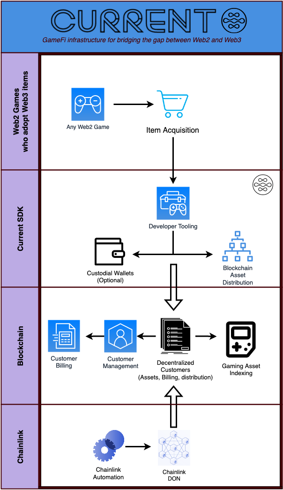

# Current
## GameFi infrastructure for augmenting Web2 games with decentralized Web3 asset ownership

---------------------------------------------------------------

  ### By Eucliss 

[](https://twitter.com/Current_GameFi)
[![Foundry][foundry-badge]][foundry]
[foundry]: https://getfoundry.sh/
[foundry-badge]: https://img.shields.io/badge/Built%20with-Foundry-FFDB1C.svg

## Description

The goal of the Current project is to bridge the gap between Web2 games and Web3. Our vision is to have open access to web3 for users and developers regardless of their comfort level with web3. We aim to be a full custodial software solution for developing and using web3 without any of the hassle of onboarding. For the purposes of the Chainlink Hackathon, we built an end demo of how a user, customer, and developer would utilize Current to build a game that rewarded the user with blockchain assets.

## High level overview

The CurrentSDK is designed to integrate with any Web2 game that implements items. For instance: Fortnite or Call of Duty skins. The game developers can continue their normal workflows of rewarding players with items in their games, the only difference is they need to make a few simple calls to the Current SDK to deliver those items to the users over the blockchain. The users will then have the option to export those assets to their own non-custodial wallet if they'd like.

In this diagram you can see Chainlink at the bottom. Chainlink is responsible for our custom on-chain billing infrastructure. As the SDK executes transactions for the game and users, the game (customer) who is responsible for those transactions gets billed on-chain. Chainlink then executes automations through the Chianlink DON to bill the customers in a decentralized trustless manner.


## Chainlink Hackathon Architecture

For the Chainlink hackathon we extended the above diagram to be specific to a discord app (mock game) we created. The app is extremely simple - it lets you "roll" a dice and recieve rewards. The idea is that this is an overly simplified reward system for a Web2 game not connected to the blockchain. The discord app does not directly touch the chain, that is all handled in the SDK. The app only interacts with the SDK and the database (see for yourself in bot.py). The app allows you to register your discord as user, then roll the dice to get rewards - this is all handled in a custodial manner. If you want to change your account from custodial to non-custodial, its just one command away (!setAddress), then you can !export your assets to your own address or hold them in the custodial address. This obfuscates all the unnecessary interactions and transactions from the user, its all in CurrentSDK.

We use chainlink here to bill the customer who deployed the game and connected it to SDK, so we automatically determine how much they owe us for the usage, and use the Chainlink DON to keep our billing decentralized and trustless.


## Purpose

There are two main drivers for this project.

1. Crypto based games suck.
  There is way too much overhead just to play a shitty crypto game.

2. Chainlink Hackathon.
  We wanted to build on-chain automated billing using Chainlink Automation.

We decided to build our Chainlink Hackathon project around these two points. The future state goal of this project is to design a system that allows anyone to build fast, state-of-the-art games on top of our SDK and obfuscate all blockchain related processes from both the users as well as the developers. 

The developers should be able to easily build on top of our software and deliver blockchain based assets to their users, and the users should have a completely seemless experience earning blockchain assets and exporting them to their own non-custodial wallet (if they want). On top of this, the user and the developer should NEVER see a transaction, they should never have to connect a wallet, connect to a blockchain, wait for execution of a transaction, etc. We should take care of all of that. This is how we onboard the masses to crypto: take the crypto and make it a true backend. In our model (future state), a developer should be able to make a simple call to our API/SDK to deliver an asset to a user, this can be in the form of ERC20, ERC721 or ERC1155. The developer only needs to know what the item is, and whats its identifier is, we will handle all the mapping and allocating and everything else. Then the developer just needs to check our database for what items the user has. The user on the other hand, just needs to play the game. When they're rewarded an item, we will store it at our custodial address and note in the database what assets the user has. From a UI/UX standpoint, there is no blockchain interaction or lag. A user does something in game (!roll) and they recieve an asset. When they decided they're ready to become non-custodial, they can set their blockchain address (!setAddress) through a UI, and export (!export) their assets to their non-custodial address. From then on, we store their address in the database and automatically send them all future rewards from the game. This allows for a completely seemless experience for the user, no more connect wallet, sketchy websites, sign transactions, scared of getting hacked, etc. We will control assets on our end - similar to how Coinbase works.

So the question now is: transactions cost money, how are you covering the cost??

This is where our smart contracts and Chainlink comes in. We have infrastructure setup to allow a new customer to register on chain. When they do so they are given a new implementation of our Customer contract and they fund it with a small fee (0.1eth). Everytime we mint an asset to a user or our custodial address, we add the transaction cost to the customers object on chain and will bill them later. This is billing through code. Then we use the chainlink DON to automate our billing process and ensure a decentralized approach to collecting fees.

This is a big reason to use Chainlink, the Decentralized Oracle Network (DON). Customers dont have to rely on us to create billing statements or charge them for their usage and they can completely trust the Chainlink DON for automated execution of their invoice contract (Customer.sol). All their charges should come directly from on chain execution (there are some problems currently and future state will solve this, remember this is a hackathon POC built in <1month and 1 engineer). This allows us to build an awesome product that connects games to the blockchain, allows customers to pay us fairly and decentralized for our code execution, and allows users and developers to have a completely obfuscated experience with blockchain assets in their games.

In the future state there are a few things we are considering to enhance our decentralized architecture and make the experience better for users and developers.
  
  1. Space and Time (decentralized database)
    - Currently we run a local mongoDB for easy development and storage of user assets, this will need to become decentralized to ensure we follow the ethos of crypto.

  2. Layer 2 (zk rollups)
    - We intend to use Layer 2 technologies to bolster our product. ZK-rollups are the future of ethereum scaling and we will need that to execute thousands of in-game transactions a second.

  3. Customer authentication through API / SDK (Zero Knowledge proofs)
    - We intend to research how we can utilize zk proofs to confirm an SDK caller is the correct customer thus ensuring that the correct calls are being made and the correct customer is getting billed.
  
  4. True SDK Build out
    - Currently we're only building in python (for dev speed). We'll need to build out the SDK in more languages that work better for gaming
  
  5. Customer portal (UI/UX)
    - The customer will need a portal to perform admin activities.
  
  6. Fiat On-Ramp
    - Not everyone wants to transact in crypto only, we'll need a way to make it so users can buy assets in game from a store and execute a transaction through us.
    - We'll also need a way for customers to deposit funds to their smart contract through our UI / UX so they dont even need to touch the chain
  
  7. Asset generation
    - We'll need more smart contracts to allow a customer to deploy assets through us, similar to how we deploy the customer invoice address in our Coordinator.sol

This is the starting point of the company Current. I plan on building out the Current ecosystem to facilitate the web2 to web3 paradigm shift in gaming. We will onboard users and make their lives easier while also providing more ownership of assets and a trustless system of interaction. This is how we onboard games to Web3.


## Discord Bot Commands:
```
1. !register
  The register command is indended to be run for each Discord user who wants to participate in the dice roll game. This adds the user to the database and adds them to the custodial wallets for recieving assets. It is not required for the user to setup their own wallet to gain assets from the roll command, but it is required for them to register with us before running !roll.

2. !roll
  This command rolls a dice for the user (random number). The user has a chance to win 100 tokens, 1000 tokens, or 1000 tokens + 1 NFT based on the outcome of the roll. The assets are automatically stored for the user in the custodial wallet or transfered to the user if they're not custodial.

3. !setAddress <address>
  This command allows a user to set their address for assets to be sent to. If a user sets their address they will not be a custodial customer and will have full control over their assets. All future assets will be distributed to this address instead of the custodial address.
  This command must be run before !export.

4. !export
  This command exports all your assets from the custodial address to the address you set using !setAddress. All the items you own will now be under your control. We will still keep track of your assets for use in the dice roll game in our database.

5. !balance
  This command will show you what we have in our database as your assets.

6. !chainBalance
  This command will tell you what assets you have on chain. If you have not set your address yet this command will tell you to do so - if this is the case the custodial address has all your assets.

----- ADMIN COMMANDS -----

1. !init
  The init function is designed to start the entire process and register the primary customer (us). The command initialized the CONFIG to a state of initialized and also deploys assets to the chain. For our game we have 2 assets: GameERC20 and GameERC721. These are simple ERC20 and ERC721 contracts that allow us to mint tokens to the users. For the purposes of this demo we're internalizing everything. In the future we will allow anyone to create a customer in our system and get billed for their usage.


2. !checkChain
  This command checks the chain to determine how many assets the custodial address has.

3. !getBill
  This command checks how much the customers bill is on-chain. The customer will be billed next time the upkeep function is called by Chainlink Automation.

4. !getUserObject
  This command gets the users object from the database. (mainly for testing)

```

## Basic flow for a customer

```
Basically it comes down to three groups:

1. I only want to register as a customer, add assets later.

2. I am a customer and want to add some assets.

3. I have assets but no invoice contract.
```

### Only Register

For this path, customers register by calling the function `registerCustomer` with the address they want to control the invoice contract. The customer will then recieve their invoice address as a response. The customer must send 0.1 ether along with this function to instantiate their invoice contract.

This customer can add assets later on for just gas costs.

### Already a customer, add assets.

For this path, the customer must already have their invoice contract established and be executing on the invoice contracts owner - this was set when they instantiated their account.

The customer then gathers all his asset contracts and their types (erc20, 721, ...) and passes them along to `registerAssets` along with the controller of the assests and their invoice address. 

### I have assets but no account.

For this path, the customer can just call the function `register` with their asset controller and assets similar to above. but without the invoice address. This function will create a cloned invoice contract for them and return the address after execution.

## What happens once I'm done loading and registering?

Now we can distribute assets to your users. You will already have given this contract access to mint and distribute your assets in the game, so now in the SDK we can automatically distribute these assets using our access to this contract. I think my logic is a little screwed up here at the moment, but all the pieces are pretty much set.

Customers can mint their assets directly to users using the mint functionality. Additionally, we're using chainlink automation to automatically bill the customers when their balance exceeds a certain threshold.

One thing I need to figure out is how to take care of all the minting and get this contract owner permissions to mint on all their contracts, thats TBD. Also if a customer wants to distribute Eth then we'll have to transfer Eth from their invoiceAddress. I think to make this even better we should deploy basic ERC20, ERC721, and ERC1155 contracts that allow the user to create assets through out SDK. I dont think this should be done via a web UI, but its certainly a possibility.

# Current State (10/26) and next steps for hackathon.

## Moving parts
- Smart contracts (minimum submission, using chainlink keepers, goerli)
- SDK
- Discord Bot

### Smart Contracts
- Coordinator.sol 
  - This is the main interactive contract for the SDK. It spawns customer contracts when new registrations happen and it bills customers everytime they execute a distribution function or mint new assets to users. Chainlink will hit this contract to check and perform upkeep, the billing is done completely in a decentralized way using the chainlink DON.

  Functions:
  - registerCustomer (address): Creates a new customer contract for a registering customer, requires 0.1 ether to initiate.
  - registerAssets (address, address, address[], ItemType[]): Registers assets to an existing customer. Takes a list of addresses of their item contracts as well as their ItemTypes (ERC20, 721, 1155).
  - registerWithAssets (address, address[], ItemType[]): Registers a new customer along with their assets.
  - distributteAssets (PackageItem[], address[]): Distributes assets to a recipient address. (WIP)
  - mintAssets (PackageItem[], address[]): Mint assets to a recipients address.
  - checkUpkeep (bytes): Chainlink Automation required function. Checks if we need to bill any customers and returns the customers that need billing in bytes form.
  - performUpkeep (bytes): Bills the customers invoice addresses, if they cant pay right now, it adds them back to the paymentsDue array. Will eventually make them un-eligible and lock their asset contracts from execution.

  Getters:
  - getCustomerContractsEncoded (address): Gets an encoded hash of customers asset addresses.
  - getCustomerContracts (address): Gets a list of customer asset addresses.
  - getEligibility (address): Checks if an invoice Address is eligible.

- utils/Customer.sol
  - This contract is an initializable contract that is cloned each time a new customer is registered. It allows the customer to deposit ETH into their account to top up their billing, and it also allows the coordinator contract to withdraw ETH through the bill function.

- lib/StructsAndEnums.sol
  - This function holds all the structs and enums that will be used.

- assets/GameERC20.sol (Mock ERC20)
- assets/GameERC721.sol (Mock ERC721)
- assets/GameERC1155.sol (Mock ERC1155)

### SDK
- connector.py
  - Hook to connect to the chain.
- coordinator.py
  - Python class that wraps the smart contract implementation, allows for easy registering of new customers and adding new assets to their customer profile.
- customerStore.py
  - This will be a layer above the MongoDB implementation. Allows for simpler storing of new customers in the db.
- db.py
  - Mongo DB implementation to store and update users, pretty basic implementation.

### Discord Bot
- bot.py
  - Allows for doing almost everything with the SDK through simple discord commands. This will serve as the demo for chainlink and it will be an open discord for them to test.

### Next steps
The most important thing is to get this project to an MVP.
For the MVP, I will be the primary customer and all my details will be setup prior to the execution of the demo. Future state there will be a way for the customer to register all their shit through a UI or the SDK itself, but for the MVP there will only be 1 customer. Realistically, once the contract is deployed, anyone can register through the smart contract and eventually that will be abstracted out to a UI.
Once the customer is all set the user should be able to go into discord, create an account, play a simple game, and get paid out on chain with whatever assets they win. The user should then be able to export their assets all while the customer is getting billed.

Most of the work needs to be done in the SDK. I'll probably be using hardcoded keys and accounts for the demo, in a production environment there would be a lot more code required to allow for anyone to create a customer through the SDK. Additionally, most of the project is on chain, so it might be better just to build a simple UI to allow any one to register as a customer. In the end that would make sense, kinda like how a standard API works. A customer would register on our website with their wallet, etc., then they would add their asset contracts or use our system to deploy more, then they would fund their invoiceAddress and build out functionality in their game for the SDK. May have to re-architecture this after the hackathon project is submitted. Will also need a UI, will connect all this with Current once we get the UI built out and add in Basin for asset distribution.


## Requirements for the hackathon

- [ ] 5 minute video
- [x] Source Code (this repo)
- [ ] Description
  - Why Layer1
- [ ] Link to Demo (discord link)

Foundry Starter Kit is a repo that shows developers how to quickly build, test, and deploy smart contracts with one of the fastest frameworks out there, [foundry](https://github.com/gakonst/foundry)!


- [Foundry Starter Kit](#foundry-starter-kit)
- [Getting Started](#getting-started)
  - [Requirements](#requirements)
  - [Quickstart](#quickstart)
  - [Testing](#testing)
- [Deploying to a network](#deploying-to-a-network)
  - [Setup](#setup)
  - [Deploying](#deploying)
    - [Working with a local network](#working-with-a-local-network)
    - [Working with other chains](#working-with-other-chains)
- [Security](#security)
- [Contributing](#contributing)
- [Thank You!](#thank-you)
  - [Resources](#resources)
    - [TODO](#todo)

# Getting Started

## Requirements

Please install the following:

-   [Git](https://git-scm.com/book/en/v2/Getting-Started-Installing-Git)  
    -   You'll know you've done it right if you can run `git --version`
-   [Foundry / Foundryup](https://github.com/gakonst/foundry)
    -   This will install `forge`, `cast`, and `anvil`
    -   You can test you've installed them right by running `forge --version` and get an output like: `forge 0.2.0 (f016135 2022-07-04T00:15:02.930499Z)`
    -   To get the latest of each, just run `foundryup`

And you probably already have `make` installed... but if not [try looking here.](https://askubuntu.com/questions/161104/how-do-i-install-make)

## Quickstart

```sh
git clone https://github.com/smartcontractkit/foundry-starter-kit
cd foundry-starter-kit
make # This installs the project's dependencies.
make test
```

## Testing

```
make test
```

or

```
forge test
```

## Running the bot

To run the bot:
`python CurrentSDK/bot.py`

To start the DB:
`brew services start mongodb-community@6.0`
or
`make mongodb-start`

To stop the DB:
`brew services stop mongodb-community@6.0`
or 
`make mongodb-stop`

If you're having issues where BasinSDK cant be found:
```
TOPDIR=${pwd}
export PYTHONPATH=${PYTHONPATH}:${TOPDIR}
```

# Deploying to a network

Deploying to a network uses the [foundry scripting system](https://book.getfoundry.sh/tutorials/solidity-scripting.html), where you write your deploy scripts in solidity!

## Setup

We'll demo using the Goerli testnet. (Go here for [testnet goerli ETH](https://faucets.chain.link/).)

You'll need to add the following variables to a `.env` file:

-   `GOERLI_RPC_URL`: A URL to connect to the blockchain. You can get one for free from [Alchemy](https://www.alchemy.com/). 
-   `PRIVATE_KEY`: A private key from your wallet. You can get a private key from a new [Metamask](https://metamask.io/) account
    -   Additionally, if you want to deploy to a testnet, you'll need test ETH and/or LINK. You can get them from [faucets.chain.link](https://faucets.chain.link/).
-   Optional `ETHERSCAN_API_KEY`: If you want to verify on etherscan

## Deploying

```
make deploy-goerli contract=<CONTRACT_NAME>
```

For example:

```
make deploy-goerli contract=PriceFeedConsumer
```

This will run the forge script, the script it's running is:

```
@forge script script/${contract}.s.sol:Deploy${contract} --rpc-url ${GOERLI_RPC_URL}  --private-key ${PRIVATE_KEY} --broadcast --verify --etherscan-api-key ${ETHERSCAN_API_KEY}  -vvvv
```

If you don't have an `ETHERSCAN_API_KEY`, you can also just run:

```
@forge script script/${contract}.s.sol:Deploy${contract} --rpc-url ${GOERLI_RPC_URL}  --private-key ${PRIVATE_KEY} --broadcast 
```

These pull from the files in the `script` folder. 

### Working with a local network

Foundry comes with local network [anvil](https://book.getfoundry.sh/anvil/index.html) baked in, and allows us to deploy to our local network for quick testing locally. 

To start a local network run:

```
make anvil
```

This will spin up a local blockchain with a determined private key, so you can use the same private key each time. 

Then, you can deploy to it with:

```
make deploy-anvil contract=<CONTRACT_NAME>
```

Similar to `deploy-goerli`

### Working with other chains

To add a chain, you'd just need to make a new entry in the `Makefile`, and replace `<YOUR_CHAIN>` with whatever your chain's information is. 

```
deploy-<YOUR_CHAIN> :; @forge script script/${contract}.s.sol:Deploy${contract} --rpc-url ${<YOUR_CHAIN>_RPC_URL}  --private-key ${PRIVATE_KEY} --broadcast -vvvv

```

# Security

This framework comes with slither parameters, a popular security framework from [Trail of Bits](https://www.trailofbits.com/). To use slither, you'll first need to [install python](https://www.python.org/downloads/) and [install slither](https://github.com/crytic/slither#how-to-install).

Then, you can run:

```
make slither
```

And get your slither output. 
